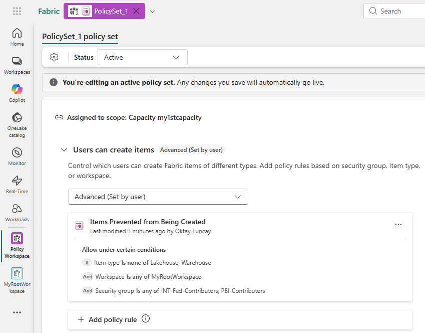
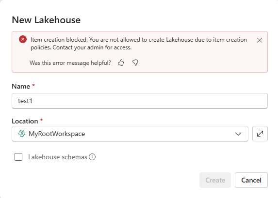

# Fabric Item Creation Policies Validation

## Background

By default, workspace contributors may have the ability to create supported Fabric item types within a workspace.

Microsoft Fabric now provides **Item Creation Policies**, allowing administrators to control which item types can be created by specific users or groups within designated workspaces.

This document validates the behavior of Item Creation Policies and demonstrates policy enforcement for restricted item types.

---

## Objective

Validate that Item Creation Policies can:

- Restrict creation of selected Fabric item types.
- Apply restrictions based on:
  - Workspace
  - Security Group
  - Item Type
- Enforce governance controls without removing workspace access.

---

## Test Environment

| Setting | Value |
|----------|--------|
| Capacity | my1stcapacity |
| Workspace | MyRootWorkspace |
| Policy Set | PolicySet_1 |
| Security Groups | INT-Fed-Contributors, PBI-Contributors |
| Restricted Item Types | Lakehouse, Warehouse |

---

## Policy Configuration

The following Item Creation Policy was configured:

- Scope: Capacity (`my1stcapacity`)
- Workspace: `MyRootWorkspace`
- Security Groups:
  - `INT-Fed-Contributors`
  - `PBI-Contributors`
- Restricted Item Types:
  - `Lakehouse`
  - `Warehouse`

### Policy Configuration Screenshot

   

   
   

   
---

## Validation Scenario

### Test Case

**Given**

- A user belongs to one of the specified security groups.
- The user has access to the workspace.

**When**

- The user attempts to create a Lakehouse.

**Expected Result**

- Lakehouse creation is blocked by policy.
- An explanatory message is displayed to the user.

**Actual Result**

- Lakehouse creation was blocked successfully.
- Fabric displayed an item creation restriction message.

### Enforcement Screenshot

   

   
   

---

## Test Result

| Validation | Status |
|------------|--------|
| Policy assigned successfully | ✅ Passed |
| Policy evaluated correctly | ✅ Passed |
| Restricted item creation blocked | ✅ Passed |
| User received restriction message | ✅ Passed |
| Workspace access retained | ✅ Passed |

---

## Conclusion

The validation confirms that Fabric Item Creation Policies can successfully restrict the creation of specific Fabric item types based on workspace, security group membership, and item type.

This capability provides a governance mechanism for controlling artifact creation while preserving workspace collaboration and access for authorized users.
